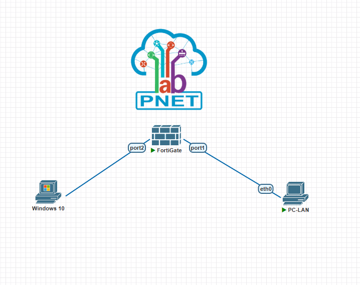
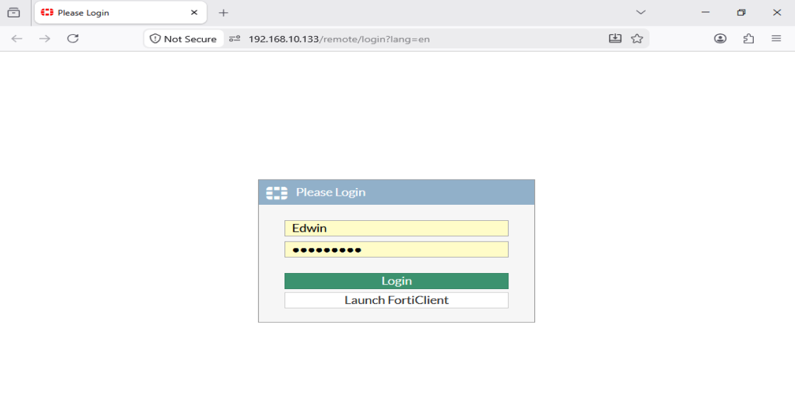
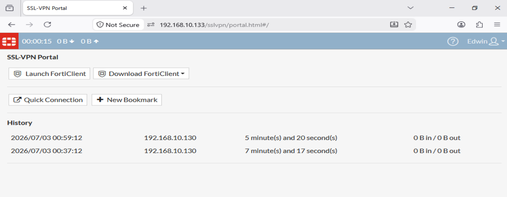
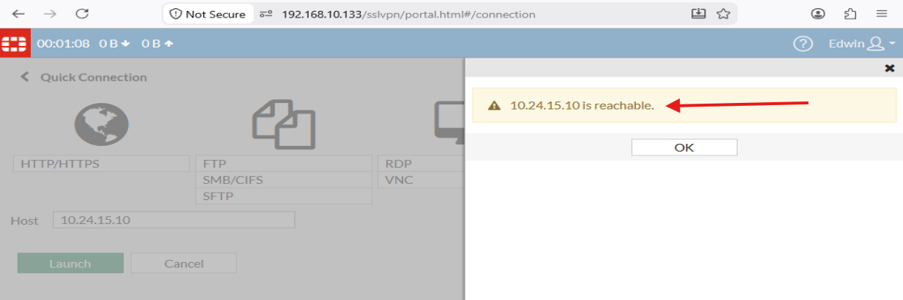
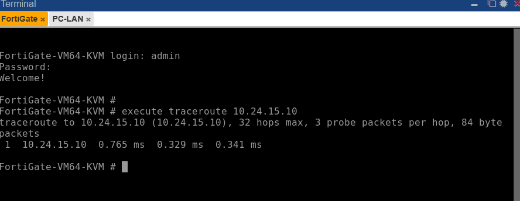

# VPN Client-to-Site FortiGate SSL-VPN

**Estudiante:** Edwin De Paula  
**Matricula:** 2024-2415  
**Institución:** Instituto Tecnológico de las Américas (ITLA)  
**Asignatura:** Seguridad en Redes

---

## Video

| Recurso | URL |
|---|---|
| Video YouTube | _pendiente_ |

---

## Objetivo

Implementar una VPN Client-to-Site utilizando SSL-VPN de FortiGate, permitiendo que un cliente Windows 10 establezca una conexión VPN segura hacia un firewall FortiGate a través de un portal web, obteniendo acceso a la red LAN interna y verificando la conectividad mediante traceroute.

---

## Topología



| Dispositivo | Interfaz | Dirección IP | Descripción |
|---|---|---|---|
| FortiGate | port2 | 192.168.10.133/24 (DHCP) | WAN — Red vmnet8 NAT |
| FortiGate | port1 | 10.24.15.1/24 | LAN interna |
| PC-LAN | eth0 | 10.24.15.10/24 | Gateway: 10.24.15.1 |
| Windows 10 | eth0 | 192.168.10.130/24 | Cliente VPN externo |
| SSL-VPN Pool | — | SSLVPN_TUNNEL_ADDR1 | Pool de IPs para clientes VPN |

---

## Parámetros de Configuración

### SSL-VPN Settings

| Parámetro | Valor |
|---|---|
| Certificado | self-sign |
| Puerto | 443 |
| Interfaz fuente | port2 |
| Portal | full-access |
| Tunnel IP Pool | SSLVPN_TUNNEL_ADDR1 |
| TLS mínimo | TLS 1.0 |

### Usuario VPN

| Parámetro | Valor |
|---|---|
| Username | Edwin |
| Password | Edwin2024 |
| Grupo | SSL-VPN-Users |

### Política de Firewall

| Parámetro | Valor |
|---|---|
| Nombre | SSL-VPN-to-LAN |
| Interfaz origen | ssl.root |
| Interfaz destino | port1 |
| Usuarios | Edwin |
| Acción | Accept |

---

## Explicación de la Configuración

### ¿Qué es SSL-VPN en FortiGate?

SSL-VPN de FortiGate permite a usuarios remotos conectarse de forma segura a la red interna a través de un portal web o un cliente dedicado (FortiClient). A diferencia de IPSec VPN que opera a nivel de red, SSL-VPN opera sobre HTTPS (puerto 443), lo que facilita su uso desde cualquier navegador sin necesidad de configuración compleja en el cliente.

### Modos de acceso SSL-VPN

FortiGate ofrece dos modos en su portal SSL-VPN:

- **Web Mode** — Acceso a recursos internos a través del navegador sin instalar software adicional. El usuario accede a aplicaciones web, SSH, RDP, y puede probar conectividad mediante ping desde el portal.
- **Tunnel Mode** — Crea un túnel de red completo, asignando una IP del pool al cliente. Requiere FortiClient instalado.

En este lab se usa el portal web (Web Mode) con el portal `full-access`.

### Componentes clave

- **ssl.root** — Interfaz virtual que FortiGate crea automáticamente para el tráfico SSL-VPN. Se usa en las políticas de firewall igual que cualquier interfaz física.
- **SSLVPN_TUNNEL_ADDR1** — Pool de direcciones IP predefinido por FortiGate para asignar a los clientes VPN en modo tunnel.
- **Grupo SSL-VPN-Users** — Agrupa los usuarios autorizados para acceder al portal y es referenciado en la authentication-rule.

### Flujo de Conexión

1. Windows 10 abre Firefox y navega a `https://192.168.10.133`
2. El navegador establece conexión HTTPS con el servidor SSL-VPN del FortiGate
3. El usuario ingresa credenciales (Edwin / Edwin2024)
4. FortiGate verifica las credenciales contra el usuario local y el grupo SSL-VPN-Users
5. Se muestra el portal full-access con opciones de Quick Connection
6. El usuario puede acceder a recursos internos y probar conectividad hacia la LAN

---

## Verificación

### Página de Login SSL-VPN



El portal SSL-VPN de FortiGate accesible desde el navegador Firefox en Windows 10 mediante `https://192.168.10.133`.

### Portal SSL-VPN Activo



El portal `full-access` activo con el usuario Edwin autenticado correctamente. El contador de tiempo confirma la sesión activa.

### Prueba de Conectividad — Portal



La función Quick Connection del portal confirma que `10.24.15.10 is reachable` — el cliente VPN puede acceder a la PC-LAN de la red interna.

### Traceroute — FortiGate

```
execute traceroute 10.24.15.10
```



El traceroute muestra un único salto directo hacia `10.24.15.10`, confirmando conectividad completa entre el servidor FortiGate y la red LAN interna.

---

## Archivos del Repositorio

```
fortigate-client-to-site/
├── configs/
│   └── FortiGate.txt
├── docs/
│   └── screenshots/
│       ├── topology.png
│       ├── login.png
│       ├── portal.png
│       ├── reachable.png
│       └── traceroute.png
└── README.md
```

---

## Herramientas Utilizadas

- PNetLab — Plataforma de emulación de red
- FortiGate VM64 KVM v6.46 build1879 — Firewall Fortinet
- Windows 10 — Cliente VPN (Firefox como navegador SSL-VPN)
- VMware Workstation — Virtualización
